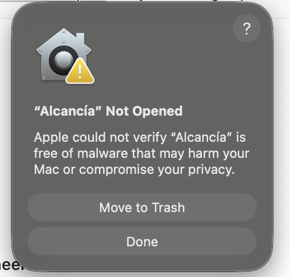
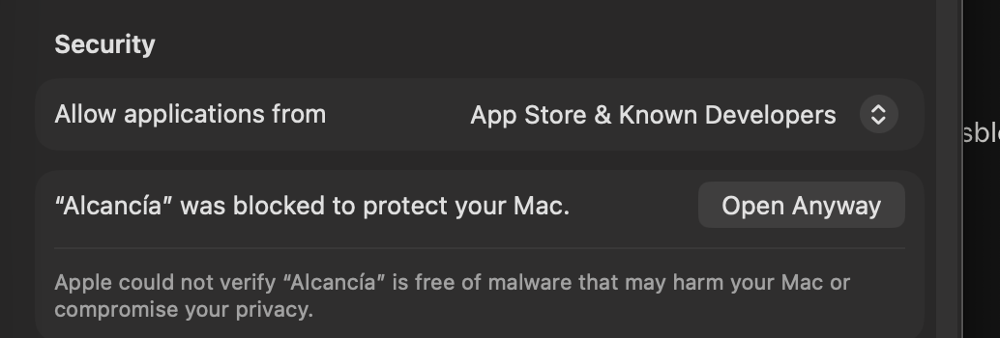
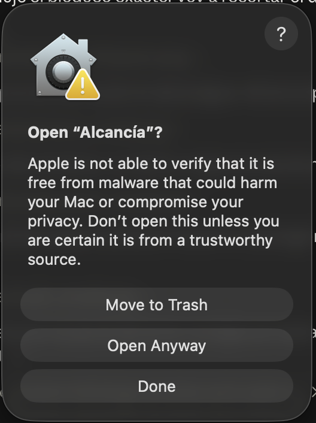
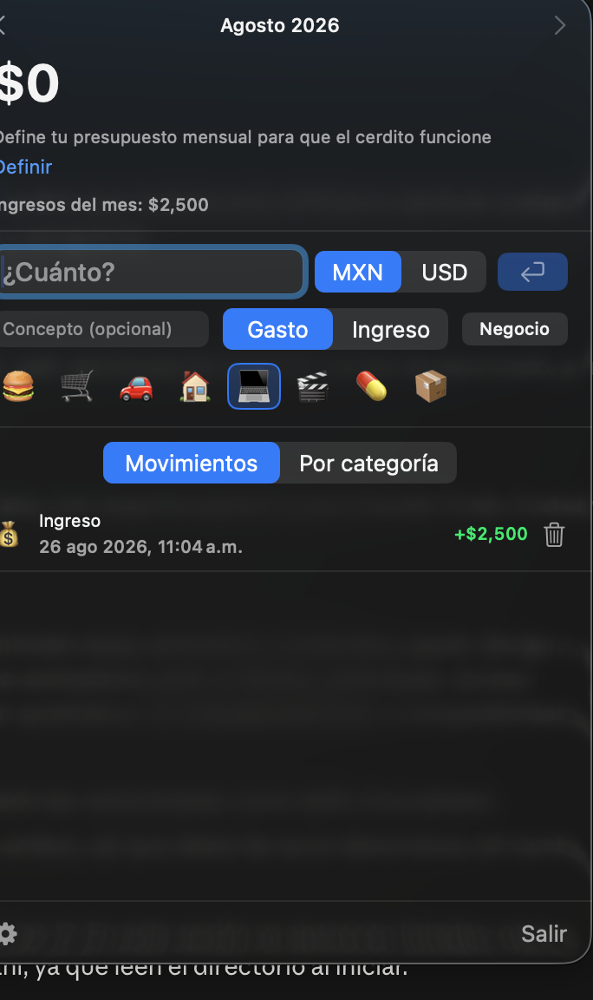

# Instalar Alcancía

Guía rápida para instalar la app en tu Mac. No necesitas saber programar.

## 1. Descarga el archivo

Descarga `Alcancia-1.0.0-arm64.zip` desde la sección
[Releases](https://github.com/marvalre/alcancia/releases) y ábrelo
haciendo doble clic para descomprimirlo. Vas a obtener `Alcancía.app`.

**Requiere macOS 14 (Sonoma) o más nuevo, en una Mac con Apple Silicon**
(M1 o más nueva). Si tu Mac es Intel, no va a abrir.

## 2. Muévela a Aplicaciones

Arrastra `Alcancía.app` a tu carpeta **Aplicaciones**.

## 3. Autorízala la primera vez

Como esta app no viene de la App Store ni de un desarrollador pagado de
Apple, macOS la bloquea la primera vez con este aviso. Es normal en
software de código abierto — significa que nadie le pagó $99 USD al año
a Apple por un certificado, no que algo esté mal.



Pulsa **Done** (no la borres) y sigue estos pasos:

1. Abre **Ajustes del Sistema → Privacidad y Seguridad**.
2. Baja hasta el final, a la sección **Security**. Ahí aparece
   *"Alcancía was blocked to protect your Mac"* con un botón
   **Open Anyway**.

   

3. Púlsalo. Te va a pedir confirmar una vez más — esta vez con un botón
   azul de **"Move to Trash"** arriba y **"Open Anyway"** abajo. Fíjate
   bien cuál tocas: el azul es el que borra la app.

   

4. Confirma con tu contraseña o Touch ID si te lo pide.
5. Abre `Alcancía.app` otra vez (desde Aplicaciones o Spotlight). Ya
   funciona, y de aquí en adelante abre normal con doble clic.

## 4. Búscala en el lugar correcto

**No es una ventana ni tiene ícono en el Dock — es una app de barra de
menú.** Busca el cerdito arriba a la derecha, junto al wifi y la
batería.



Empieza por definir tu **presupuesto mensual** (el link "Definir" que
aparece cuando no tienes uno) — sin eso el cerdito se queda vacío y no
tiene de qué agarrarse.

Para capturar un gasto sin tocar el mouse: **⌥⌘A** desde cualquier
parte del sistema.

## Permisos que te va a pedir

| Cuándo aparece | Para qué es |
|---|---|
| Al activar "Iniciar con el sistema" | Elementos de inicio — para que abra sola al prender la Mac |
| Al usar el atajo global ⌥⌘A | Ninguno — usa un atajo de teclado clásico (Carbon), no necesita permiso de Accesibilidad |

Todo se procesa **en tu Mac**. Alcancía sólo hace una llamada de red en
toda su vida: consultar el tipo de cambio del dólar cuando capturas un
gasto en USD (`api.frankfurter.app`, pública, sin cuenta ni llave). No
manda tus movimientos a ningún lado — puedes comprobarlo leyendo el
archivo donde se guardan:

```bash
cat ~/Library/Application\ Support/Alcancia/data.json
```

## ¿Problemas?

- **"Alcancía no se puede abrir porque no se puede verificar"** →
  repite el paso 3.
- **No aparece nada en la barra de menú** → revisa en el Monitor de
  Actividad que "Alcancia" esté corriendo; si no, ábrela de nuevo desde
  Aplicaciones.
- **El atajo ⌥⌘A no responde** → ciérrala y ábrela de nuevo; el atajo
  se registra al arrancar.
